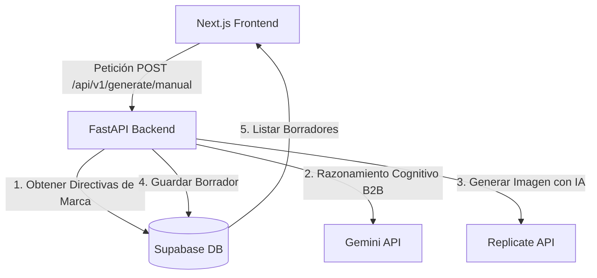

# Plataforma Autónoma de Contenidos B2B - Puna Tech

Este documento detalla la arquitectura, las funcionalidades implementadas y el proceso de generación de contenidos de la plataforma diseñada para **Puna Tech**. 

La aplicación combina un backend robusto e inteligente en **Python (FastAPI)** con una interfaz moderna y premium en **Next.js (Tailwind CSS v4 & TypeScript)**, conectada a **Supabase** y motores de IA de clase frontera (**Gemini API** y **Replicate FLUX**).

---

## 🏗️ Arquitectura del Sistema

El sistema sigue una arquitectura desacoplada y modular diseñada para ser escalable a un modelo SaaS (Multi-tenant):



1. **Frontend (Next.js 15+ & Tailwind CSS v4)**: Interfaz de usuario interactiva y fluida que cuenta con control manual, visualización de publicaciones por lotes y un "Modo Demo" resiliente que mantiene la UI activa mediante mocks de alta calidad si los servidores están apagados.
2. **Backend (FastAPI)**: Servidor de alto rendimiento que expone endpoints para generación, control de perfiles, plantillas y estados de aprobación. Incluye un planificador de tareas en segundo plano (`APScheduler`) para automatizar el backlog.
3. **Base de Datos (Supabase / PostgreSQL)**: Almacenamiento persistente estructurado con políticas de seguridad a nivel de fila (RLS) preparadas para multi-tenancy corporativo.
4. **Motor Cognitivo (Gemini 2.5 Flash / 1.5 Flash / 2.5 Pro)**: Genera texto estructurado en JSON y prompts de imagen optimizados para B2B.
5. **Motor Visual (Replicate FLUX)**: Generador de imágenes de alta fidelidad con control de paletas de colores y estilos.

---

## 🌟 Funcionalidades Implementadas

La plataforma está dotada de herramientas orientadas a maximizar la conversión B2B y agilizar el flujo de trabajo del operador:

### 1. Human-in-the-Loop (Aprobación Manual)
Ningún post se publica de forma automática en redes sociales. Todo el contenido nace en estado `draft` (borrador) y requiere que el operador lo revise, ajuste y marque como `approved` (aprobado) o `rejected` (descartado).

### 2. Generación Manual Multi-plataforma
Permite seleccionar múltiples redes sociales simultáneamente (**LinkedIn, X, Instagram**) e ingresar un único tema. La IA generará de forma concurrente copys personalizados para cada red basándose en sus reglas de formato (hilos cortos para X, tono profesional para LinkedIn y estructura de diapositivas para Instagram).

### 3. Ajustes Avanzados de Branding
* **Paleta de Colores**: Inyección de colores de marca (ej. los colores oficiales de Puna Tech: Terracota `#af4c24`, Caoba `#6d2c2c` y Crema `#f8f4f0`).
* **Estilo Visual**: Guías de diseño para las imágenes (ej. *renders 3D, isométrico, vectores técnicos*).
* **Tono del Texto**: Modificadores dinámicos de estilo (ej. *persuasivo, técnico, enfocado en el ROI*).

### 4. Selector de Formato Visual
* **Imagen Única**: Un post estándar con un gráfico de acompañamiento.
* **Carrusel (Slides)**: Divide automáticamente el copy en diapositivas estructuradas e instruye a la IA para renderizar **texto tipográfico superpuesto** en la imagen de portada.
* **Solo Texto**: Omite por completo la generación de imágenes para crear publicaciones rápidas.

### 5. Selector de Modelos de Imagen (Replicate)
Permite alternar en tiempo real el modelo de generación visual:
* **FLUX Schnell**: Ultra rápido (~2 segundos) y económico ($0.003 por imagen).
* **FLUX Dev**: Mayor calidad fotográfica y excelente capacidad para renderizar palabras y tipografía legible dentro de la imagen ($0.025 por imagen).
* **SDXL 1.0**: Modelo de Stable Diffusion clásico y equilibrado.

### 6. Perfiles de Usuario y Plantillas de Preferencias
* **Perfiles**: Permite crear perfiles de usuario (Nombre y Email) y alternar entre ellos para asociar el contenido generado al autor correspondiente.
* **Plantillas**: Guarda la configuración actual del formulario (colores, estilos, tono, canales y formatos) bajo un nombre personalizado para volver a cargarla con un solo clic.

### 7. Acciones de Publicación Rápida
* **Copiar Texto**: Botón de un solo clic que copia el copy formateado al portapapeles con confirmación visual dinámica (`¡Copiado!`).
* **Descargar Imagen**: Abre/descarga el activo visual de alta resolución directamente en una pestaña nueva para guardarlo.

---

## ⚙️ ¿Cómo Genera el Contenido la IA? (Flujo de Trabajo)

Cuando el usuario ingresa un tema y presiona **"Solicitar IA"**, el sistema ejecuta la siguiente lógica:

```
[Usuario solicita un tema B2B]
               │
               ▼
┌───────────────────────────────┐
│     1. MOTOR COGNITIVO        │
│     (Gemini API Call)         │
│                               │
│  - Recibe el tema B2B.        │
│  - Adapta el copy por red.    │
│  - Diseña el prompt visual.   │
│  - Inyecta textos en portada  │
│    si es formato carrusel.    │
└──────────────┬────────────────┘
               │
               ▼
┌───────────────────────────────┐
│       2. TOLERANCIA A         │
│     FALLOS (FALLBACK)         │
│                               │
│  - Si falla Gemini 2.5 por    │
│    saturación (503)...        │
│  - Reintenta con 1.5-flash.   │
│  - Reintenta con 2.5-pro.     │
└──────────────┬────────────────┘
               │
               ▼
┌───────────────────────────────┐
│      3. GENERACIÓN VISUAL     │
│       (Replicate FLUX)        │
│                               │
│  - Si no es "Solo Texto"...   │
│  - Pasa el prompt a FLUX.     │
│  - Inyecta paleta de colores.  │
│  - Retorna URL de imagen.     │
└──────────────┬────────────────┘
               │
               ▼
┌───────────────────────────────┐
│       4. PERSISTENCIA         │
│     (Supabase database)       │
│                               │
│  - Inserta los posts en la    │
│    tabla `generated_assets`   │
│  - Estado inicial: 'draft'.   │
└──────────────┬────────────────┘
               │
               ▼
┌───────────────────────────────┐
│      5. CONTROL DE OPERADOR   │
│         (Dashboard UI)        │
│                               │
│  - Renderiza las tarjetas.    │
│  - Copiar copy / Descargar.   │
│  - Aprobar o Descartar.       │
└───────────────────────────────┘
```

### Ingeniería de Prompts B2B (Foco en Demanda)
El motor de Gemini está calibrado con una directiva de sistema (System Instruction) estricta:
1. **Evita clichés de marketing**: Prohíbe frases genéricas como *"En la era digital..."*, *"Descubre el poder..."*, o *"Revoluciona tu..."*.
2. **Hook Directo**: Comienza con preguntas retóricas de fricción o métricas impactantes (ej. *¿Cuántas horas pierde tu equipo en data-entry?*).
3. **Conversión Basada en Valor**: Traduce la tecnología técnica a valor financiero y ahorro de tiempo (Time ROI).
4. **Restricción de Emojis**: Limitado a un máximo de 2 emojis por post para preservar la sobriedad ejecutiva.
